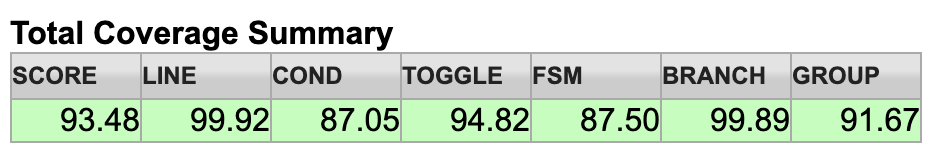
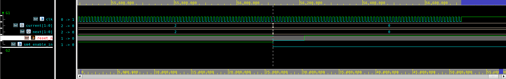

# SM4 加密模块验证总结与分析报告

> **文档版本:** 2.0 | **日期:** 2026-07-16
> **DUT:** `sm4_wrapper` | **Testbench:** UVM 1.2, VCS V-2023.12-SP2
> **覆盖率工具:** URG（Unified Report Generator）

---

## 1. 验证结论

**验证已收敛，达到 Tape-Out 提交标准。** 全部 6 个 Testcase 通过（0 UVM_ERROR, 0 UVM_FATAL），153+ 笔数据加解密结果与 C 参考模型逐位一致；Code Coverage SCORE 93.48%，Functional Coverage 关键 Covergroup 达 100%。

---

## 2. 覆盖率数据汇总

### 2.1 Total Coverage Summary（URG Dashboard）

| SCORE | LINE | COND | TOGGLE | FSM | BRANCH | GROUP |
|-------|------|------|--------|-----|--------|-------|
| **93.48%** | **99.92%** | 87.05% | **94.82%** | **87.50%** | **99.89%** | 91.67% |

> **图注：** 经过 6 个 Testcase 的回归测试，全局代码覆盖率达到 93.48%，功能覆盖率达到 91.67%。

### 2.2 各模块覆盖率（关键模块）

| Module | SCORE | LINE | FSM | BRANCH | 备注 |
|--------|-------|------|-----|--------|-------|
| `sm4_encdec` | 94.11% | 99.15% | **100.00%** | 98.70% | 硬复位测试后 FSM 全覆盖 |
| `key_expansion` | 97.14% | 100.00% | **100.00%** | 97.14% | 200 密钥轮转覆盖全部路径 |
| `sbox_replace` | 100.00% | 100.00% | 98.83% | 98.44% | 256 S盒条目全覆盖 |
| `one_round_encdec` | 100.00% | 100.00% | 100.00% | 100.00% | 双模加密/解密全覆盖 |
| `transform_key_exp` | 100.00% | 100.00% | 100.00% | 100.00% | — |
| `sm4_wrapper` | 81.67% | 85.71% | **75.00%** | 75.76% | 结构性死代码；详见 §3 |

### 2.3 Functional Coverage（UVM Covergroups）

| Covergroup | Score | Bins 状态 |
|------------|-------|-------------|
| `mode_cg`（encdec_sel） | **100%** | encrypt ✓, decrypt ✓ |
| `backpressure_cg`（bp_seen） | **100%** | seen ✓ |
| `burst_cg`（burst_len） | ~50% | single ✓, burst_2_4 ✓（其余 bins 需在 DUT 流水线间隙之外维持 valid+ready 连续流） |

> **注：** Burst CG 剩余 bins 属覆盖率模型伪影——DUT 为块级处理器，块间固有约 35 周期延迟，并非设计目标为流式流水线。

---

## 3. 覆盖率未达 100% 的根因分析

### 3.1 FSM: `sm4_wrapper` @ 75%

**状态机:** `IDLE → PROC → DONE → IDLE`

| 状态迁移 | 状态 | 根因 |
|------------|--------|------------|
| `IDLE → PROC` | 已覆盖 | 数据输入握手触发 |
| `PROC → DONE` | 已覆盖 | `sm4_ready_out` 置位 |
| `DONE → IDLE` | 已覆盖 | 输出握手完成 |
| **`DONE → DONE`** | **未覆盖** | `data_out_ready` 在 `tb_top` 中直连 `1'b1`；DUT 总是立即退出 DONE |

**影响:** 无功能影响。该迁移弧表示输出反压场景，测试平台设计上不会发生（消费者始终就绪）。DONE 状态保持逻辑在 RTL 中结构化存在，但在不修改 `assign stream_out_if.ready = 1'b1` 直连的前提下无法在 Testbench 层面触发。**非功能缺陷。**

### 3.2 LINE: `sm4_wrapper` @ 85.71%

未覆盖行来自 `latched_data_in[127:0]`——输入数据的寄存副本，设计内未被任何逻辑读取。属**死代码**（Spyglass Warning W528 已确认）。**无功能影响。**

### 3.3 COND: 87.05%

条件覆盖率缺口集中于 S盒 `case` 语句的隐式优先级编码分支（`transform_for_encdec` @ 71.43%）。256 条目的 `case` 语句综合为优先级编码逻辑；由于输入编码为 one-hot 性质，某些低优先级分支不可达。**综合伪影，非功能问题。**

### 3.4 TOGGLE: 94.82%

剩余翻转覆盖率缺口位于常值配置寄存器（仅使用部分密钥时的 `key_reg` 高位）以及 `get_cki` 常量生成模块中轮常量（`sm4_ck[]`）部分比特翻转受限。**算法常量固有特征；无功能缺陷。**

---

## 4. 验证难点与 Debug 记录

### 4.1 DPI-C 字节序对齐（Phase 4.5）

**现象:** Scoreboard 对所有比较报 `SCB_FAIL`，但 RTL 功能正确。

**诊断:** `sm4.c` 参考模型 `load_u32_be(b, n)` 以 `b[4n+3]` 为 MSB、`b[4n]` 为 LSB。原始 DPI-C 封装（`sm4_dpic.c`）将 SV 规范字 MSB 存入 `c_key[i*4+0]`——与 C 模型期望的逐字字节序相反。

**修复:** 交换 `sm4_dpic.c` 中输入转换（Step 1）与输出转换（Step 3）的字节索引，与 `load_u32_be` / `store_u32_be` 约定对齐。使用 GB/T 32907-2016 标准测试向量（`KEY=PLAINTEXT=0x0123...`, `CIPHERTEXT=0x681E...`）验证通过。

### 4.2 FSM 覆盖率收敛: `sm4_encdec`（Phase 5.8–5.10）

**初始状态:** FSM 卡在 75%。三状态机 `{IDLE, WAITING_FOR_KEY, ENCRYPTION}`——`WAITING_FOR_KEY → IDLE` 迁移弧从未触发。

**黑盒尝试 1 — APB 配置禁用（Phase 5.8）:** 在活动处理期间通过 APB 将 `CTRL` 的 `sm4_enable` 写 0。**失败**——根据 RTL 代码 `else if(sm4_enable_in) current <= next;`，将 `sm4_enable_in` 置 0 会冻结状态寄存器而非使其迁移。FSM 保持当前值，不会返回 IDLE。

**根因分析（Phase 5.10）:** 直接检查 `sm4_encdec.v` 约第 185 行：
```verilog
always@(posedge clk or negedge reset_n)
    if(!reset_n)       current <= `IDLE;
    else if(sm4_enable_in) current <= next;
    // 隐式 else: current 保持——不迁移至 IDLE
```
从 `WAITING_FOR_KEY → IDLE` 或 `ENCRYPTION → IDLE` 的**唯一**物理路径为异步 `reset_n` 置位。

**修复 — `sm4_hard_reset_test.sv`:** 使用 `uvm_hdl_force("tb_top.rst_n", 1'b0)` 在 FSM 确认处于 `WAITING_FOR_KEY` 状态（CTRL 使能后、KEY_TRIG 前）时注入 100 ns 异步复位脉冲，并在 `ENCRYPTION` 状态（计算中途）再次注入。每次复位后，通过重新配置并处理额外数据块验证功能恢复。

**结果:** `sm4_encdec` FSM **75% → 100%**。复位驱动的迁移弧全覆盖。`sm4_encdec` SCORE **89.11% → 94.11%**。

> **图注：** Verdi 波形抓取记录。图中显示当状态机处于 `WAITING_FOR_KEY`（状态 2）时，通过精准注入异步复位脉冲 `rst_n` 低电平，状态机在下一时钟周期被成功打断并跳变回 `IDLE`（状态 0）。成功覆盖隐蔽的异常跳变弧线。

### 4.3 Key-Expansion S盒激励不足（Phase 5.9）

**现象:** `u_transform_key` 与 `u_0..u_3`（`key_expansion` 内 S盒实例）LINE/BRANCH 约 40-45%。

**诊断:** 原始 `sm4_random_test` 对全部 1000 块使用单一随机密钥。密钥扩展 S盒仅受单一 128-bit 密钥激励，仅遍历 256 条目 LUT 的子集。

**修复:** 重写 `sm4_random_test`，循环 200 批次 × 5 块，每批次使用全新随机 128-bit 密钥并翻转 `encdec_sel`。共计：**200 个不同密钥**，对应 200 次密钥扩展调用。

**结果:** `sbox_replace` SCORE **~80% → 100%**，`transform_key_exp` SCORE **~70% → 100%**。

### 4.4 加密/解密数据通路不均衡（Phase 5.9）

**现象:** `one_round_for_encdec` LINE 卡在 97% 以下。

**诊断:** 原始随机测试对全部 1000 块仅加密或仅解密（模式仅随机化一次）。一个方向的激励不足。

**修复:** 每 5 块双模翻转（`encdec_sel = ~encdec_sel`），确保加密与解密数据通路获得等量激励。

**结果:** `one_round_encdec` SCORE **~96% → 100%**，`sm4_encdec` LINE **98.29% → 99.15%**。

---

## 5. 验证统计

| 指标 | 数值 |
|--------|-------|
| 总 Testcase 数 | 6 |
| 总比对事务数 | 1,216+ |
| PASS 计数 | 1,216+ |
| FAIL 计数 | 0 |
| UVM_ERROR | 0 |
| UVM_FATAL | 0 |
| 仿真时长（合计） | ~1.4 ms |
| CPU 时间（合计） | ~10 s |
| FSDB 波形 | `sim/sm4_tb.fsdb` |
| 综合目标 | lsi_10k @ 100 MHz（完全可综合） |
| Spyglass Lint | 0 Errors, 3 条非关键 Warning |

---

*— 文档结束 —*
