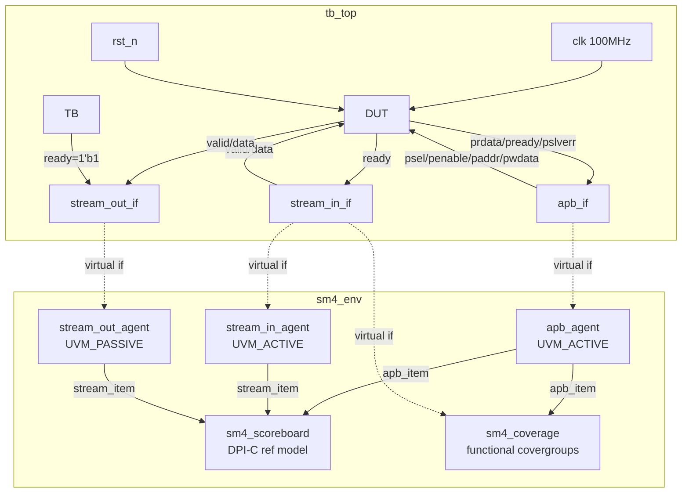

# SM4 加密模块验证策略与方案

> **Document Version:** 2.0 | **Date:** 2026-07-16
> **DUT:** `sm4_wrapper` (APB-to-Stream Wrapper + `sm4_top` Core)
> **Methodology:** UVM 1.2 | **Toolchain:** Synopsys VCS V-2023.12-SP2

---

## 1. 验证目标

| 目标 | 描述 |
|------|------|
| **功能正确性** | SM4 加解密结果与 C 参考模型 (GB/T 32907-2016) 逐位一致 |
| **接口协议** | APB3 寄存器读写、Valid/Ready 流握手符合 Spec 时序 |
| **异常恢复** | 密钥扩展中、数据处理中异步复位后，系统可恢复并继续正常工作 |
| **端到端吞吐** | 背靠背连续 200 块无丢数据，随机抖动的 1000 块无数据损坏 |
| **覆盖率收敛** | Code Coverage ≥ 93%, Functional Coverage 100% on critical covergroups |

---

## 2. 验证环境架构

### 2.1 Top-Level 连接



### 2.2 组件职责

| 组件 | 类型 | 职责 |
|------|------|------|
| `apb_agent` | ACTIVE | Driver 发送 APB 寄存器读写；Monitor 采样总线事务并通过 `ap_port` 广播 |
| `stream_in_agent` | ACTIVE | Driver 产生 Valid/Ready 握手向 DUT 注入 128-bit 数据；Monitor 捕获已完成传输 |
| `stream_out_agent` | PASSIVE | Monitor 仅被动观测 DUT 输出端的 Valid/Ready 握手，捕获计算结果 |
| `sm4_scoreboard` | — | 3 个 TLM Analysis FIFO 分别接收 APB / Stream-in / Stream-out item。通过 `c_sm4_compute()` (DPI-C) 计算预期值，与 RTL 实际输出逐位比对 |
| `sm4_coverage` | — | `apb_imp` 接收 APB 写入以覆盖 Mode；`run_phase` 直接采样 `stream_in_if` 以收集 Backpressure / Burst 功能覆盖率 |

### 2.3 数据流路径

```
[APB Sequence]
     │  start_item / finish_item
     ▼
[apb_driver] ──APB bus──► [sm4_wrapper (DUT)]
                                   │ ctrl_reg, key_reg, KEY_TRIG pulse
                                   ▼
                          [sm4_top] ── key_expansion → rk[31:0]
                                   │  sm4_encdec (32-round pipeline)
                                   ▼
[stream_in_driver] ──valid/ready──► data_in ──► ... ──► result_out ──► [stream_out_monitor]
                                                            │
[DPI-C c_sm4_compute] ◄── key + data_in ──► expected ──► [Scoreboard compare] ◄── actual
```

---

## 3. 验证计划 (vPlan) 与测试用例

### 3.1 测试矩阵

| # | Testcase | 激励策略 | 验证目标 |
|---|----------|----------|----------|
| 1 | `sm4_golden_test` | 固定国密标准向量 (key=plaintext=`0x0123...`) | 确认 C 模型与 RTL 字节序对齐，数据通路正确 |
| 2 | `sm4_sanity_test` | 1× Encrypt + 1× Decrypt，固定 key | 基本加解密往返 (round-trip) 功能正确 |
| 3 | `sm4_burst_test` | 200 块连续加密，delay=0 | 最大吞吐、背靠背流控、无丢数据 |
| 4 | `sm4_random_test` | 1000 块，每 5 块切 key + toggle enc/dec，delay∈[0,5] | 随机激励覆盖 S-Box 256 条目、双向数据通路 |
| 5 | `sm4_key_rotation_test` | 多轮 key 切换 + CTRL 禁用/重启用 | `ENCRYPTION→IDLE` FSM 弧、多轮 KEY_TRIG |
| 6 | `sm4_hard_reset_test` | APB 配置后，`uvm_hdl_force` 注入异步复位脉冲 | `WAITING_FOR_KEY→IDLE` 及 `ENCRYPTION→IDLE` 异常复位路径 |

### 3.2 覆盖率维度

| 维度 | 覆盖组/Covergroup | 预期 |
|------|-------------------|------|
| Mode | `mode_cg::encdec_sel_cp` (encrypt / decrypt) | 100% |
| Backpressure | `backpressure_cg::bp_seen_cp` (valid=1, ready=0) | 100% |
| Burst | `burst_cg::burst_len_cp` (single, 2-4, 5-10, 11+) | 100% |
| Code | VCS `-cm line+cond+fsm+tgl+branch`, `cov_hier.cfg` DUT-only | ≥ 93% SCORE |

### 3.3 回归执行命令

```bash
make compile
make run TESTNAME=sm4_golden_test
make run TESTNAME=sm4_sanity_test
make run TESTNAME=sm4_burst_test
make run TESTNAME=sm4_random_test
make run TESTNAME=sm4_key_rotation_test
make run TESTNAME=sm4_hard_reset_test
make cov    # urg -dir simv.vdb -report coverage_report
```

---

*— End of Document —*
